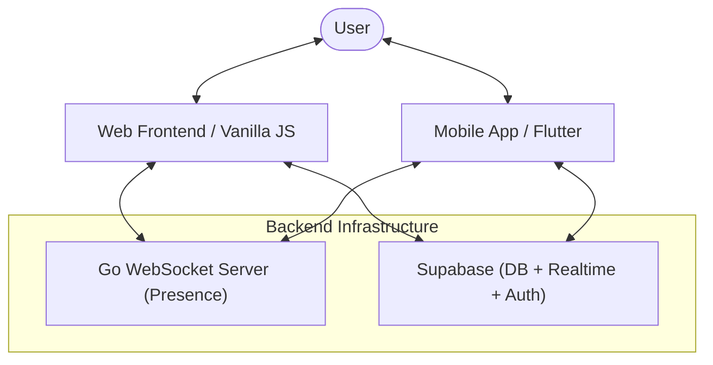

# 🗨️ RealTalk: Multi-Platform Real-Time Messenger

RealTalk is a high-performance, real-time chat ecosystem featuring a **sleak Web Dashboard** and a **modern Flutter Mobile Application**. It bridges a persistent database with a live presence system, delivering a seamless messaging experience across all devices.

---

### ✨ Real-Time Features & Why it's Awesome

- **🏠 Smart Room Management**: Create rooms with a unique **Room Name** and **Room ID (Password)**. Join rooms instantly or stay in the 'Public' lounge.
- **⚡ Persistent Real-Time Messaging**: Powered by **Supabase Realtime**, messages appear instantly across web and mobile without refresh.
- **🟢 Live Presence System**: A ultra-lightweight **Go WebSocket server** tracks who's online and broadcasts status in real-time.
- **🧹 Local Privacy**: Clear your chat history locally or delete specific messages without affecting others.
- **📱 True Multi-Platform**: Consistent WhatsApp-inspired UI across Flutter (iOS/Android) and Vanilla Web.
- **🛡️ Secure Foundation**: Row Level Security (RLS) ensures only authenticated users can read and write data.

---

### 🛠 Technology Stack

#### **Core Backend & Infrastructure**
- **[Go (Golang)](https://golang.org/)**: Presence coordinator and real-time WebSocket messaging server.
- **[Supabase](https://supabase.com/)**: 
  - **PostgreSQL**: Robust message storage and room relational data.
  - **GoTrue Auth**: Secure username/password authentication.
  - **Realtime**: Database event listeners for zero-latency updates.

#### **Frontend Clients**
- **Mobile**: [Flutter](https://flutter.dev/) (Material 3, Dart) with state-of-the-art animations.
- **Web**: Vanilla [JavaScript](https://developer.mozilla.org/en-US/docs/Web/JavaScript), HTML5/CSS3 (Zero dependency, high performance).

---

### 🎨 Visual Architecture



---

### 📁 Project Structure

```text
RealTalk/
├── app/            # Flutter Mobile Application (iOS/Android)
├── server/         # Go WebSocket Server (Presence Engine)
├── web/            # Optimized Web Frontend (Vanilla JS)
├── supabase_setup/ # SQL Schema, RLS, & Database Policies
└── README.md       # Project Documentation
```

---

### 🚀 Quick Start Guide

#### **1. Database Setup (Supabase)**
1. Create a new Supabase project.
2. Go to the **SQL Editor** in your Supabase dashboard.
3. Paste and run the contents of [`supabase_setup.sql`](./supabase_setup.sql). This will create all tables, enable RLS, and set up the necessary Realtime publications.

#### **2. Presence Server (Go)**
```bash
cd server
go run main.go
```
*Port: 8080 (Set via env).*

#### **3. Web Frontend**
Serve the `web` directory using any static file server, or simply open `web/index.html`.
*Update `SUPABASE_URL` and `SUPABASE_ANON_KEY` in `web/app.js`.*

#### **4. Mobile App (Flutter)**
```bash
cd app
# Update SUPABASE_URL and SUPABASE_ANON_KEY in lib/main.dart
flutter pub get
flutter run
```

---

### ☁️ Deployment (Free Tier Tip)

To deploy the Go server on **Render** (Free Tier) without it sleeping:
1. In Render Dashboard, go to your service **Environment**.
2. Add `APP_URL` as an environment variable with your Render app URL.
3. The server will automatically ping its `/health` endpoint every 14 minutes to stay awake.

---

### 🛡️ Secure by Design
This project uses **Row Level Security (RLS)**. By default:
- Users can only see rooms they have joined.
- Only room creators can delete rooms.
- Message deletions are per-user (local clear) unless otherwise configured in policies.

---

### 🤝 Contributing
Contributions are welcome! Feel free to open issues or submit pull requests to enhance the RealTalk ecosystem.

---

*Built with ❤️ by [Nithinaug](https://github.com/Nithinaug)*
